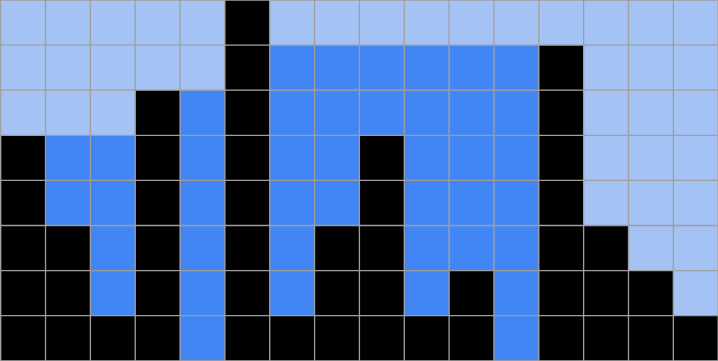

# سوال آب

سوال شرکت سبحان

## روش حل

با توجه به ارتفاع بلندترین آپارتمان ظرفیت ذخیره آب بدون در نظر گرفتن ریزش از طرفین را محاسبه میکنیم (ناحیه آبی رنگ، آبی کم رنگ و پر رنگ).

در مرحله بعد یکبار از سمت چپ و یکبار از سمت راست بصورت قدم به قدم تا رسیدن به بلندترین آپارتمان، آب سر ریز شده از طرفین را (ناحیه آبی کم رنگ) از ظرفیت کلی کم می‌کنیم.

### پیچیدگی الگوریتم
پیچیدگی الگوریتم از مرتبه `O(n)` است.

